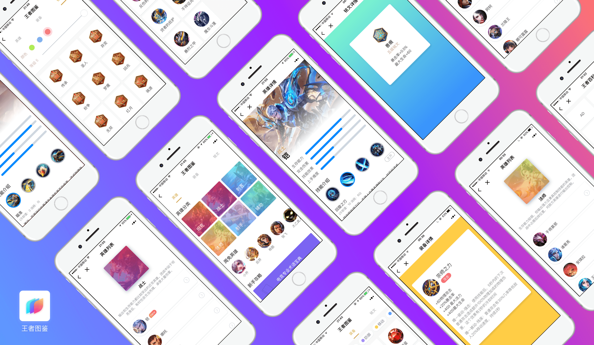
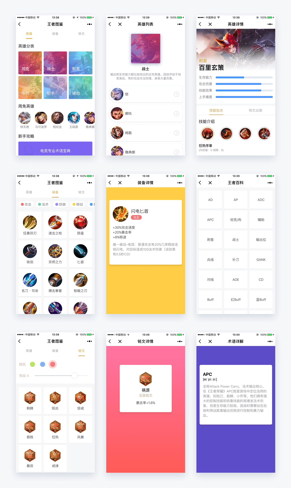

# 【微信小程序】王者图鉴 



灵感源于今年很火的手游——王者荣耀，偶尔用手机上网查找游戏数据并不是很方便，于是有了开发“王者图鉴”小程序的想法。从官网爬取数据，将英雄、装备、铭文等信息整合在微信小程序中，随时随地查询游戏信息。

## 预览

### 效果展示



### 线上体验

微信扫一扫下方的小程序码，立即体验：


## 技术栈

- 原型设计：sketch
- 后台数据爬取：node.js + leancloud ([开源地址](https://github.com/kaeyleo/king-of-glory-spider))
- 前端：[小程序生态](https://mp.weixin.qq.com/debug/wxadoc/dev/framework/MINA.html)(WXML/WXSS/JavaScript...)

## 使用

首先点击右上角的 `Fork` 或者绿色按钮 `Clone or download` 下载源码，使用[微信开发者工具](https://mp.weixin.qq.com/debug/wxadoc/dev/devtools/devtools.html)进行调试和开发。微信也提供了[小程序开发文档](https://mp.weixin.qq.com/debug/wxadoc/dev/)，从注册小程序、开发工具、开发调试到发布，提供了整套方案，类似Apple那样打造了一个自己的生态圈。

项目一共9个页面，涉及列表展示、英雄详情、装备分类、铭文条件筛选等功能，由于后台使用了[leancloud](https://leancloud.cn/)的存储服务，所以没有使用小程序的ajax api，并且引入的leancloud sdk需要依赖一个在名为 `leancloud.config.js` 的文件，它被放在 `utils` 文件夹里，由于leancloud这类三方服务通常是弹性付费的，并且王者图鉴已经在微信上正式发布，所以我push代码时ignored了 `leancloud.config.js` ，请谅解。

`leancloud.config.js` 包含了leancloud应用的AppID和AppKey信息：

```javascript
module.exports = {
  appId: '你的AppID',
  appKey: '你的AppKey'
}
```

在使用项目之前，需要自行创建leancloud应用，并搭建我之前写的 `王者荣耀官网爬虫` 获取数据，它们都需要 `leancloud.config.js` 文件。

## 总结

简单来说说微信小程序的开发吧，有段时间在网上炒得沸沸扬扬，然后抽空看了看开发文档，卧槽，这不是Vue.js么？！看下面的示例就知道了。

小程序：

```javascript
Page({
	data: {
		list: []
	},
	onload: function () {
		this.setData({
			list: [1, 2, 3]
		})
	}
})
```

```html
<view wx:for="{{ list }}">{{ item }}</view>
```


Vue.js:

```javascript
new Vue({
	data: {
		list: []
	},
	mounted: function () {
		this.list = [1, 2, 3]
	}
})
```

```html
<view v-for="item in list">{{ item }}</view>
```

虽然api看起来都挺像，但还是有明显区别的：

- 小程序是单向数据绑定，不提供类似vue的v-model指令
- 数据绑定的表达式只支持在双大括号中，如果写成 `wx:for="item in list"` 就会报错
- 操作数据对象需要调用setData方法触发更新，而不是vue那样直接赋
- 绑定事件需要模板指令声明是否冒泡

小程序有两个线程，分别对应View(视图)和AppService(逻辑)两个独立模块。View用来渲染模板、样式，AppService则用来处理业务逻辑、数据请求、API调用等。感兴趣的同学可以参考：[《微信小程序架构解析》](https://zhuanlan.zhihu.com/p/25105936?utm_medium=social&utm_source=weibo)。另外，[小黄人外卖团队](https://juejin.im/user/58a65eafac502e006cc07db2)的小程序文章也不错。


说回「王者图鉴」，这是我的第一个小程序，对于有经验的前端，跟着官方文档一天就能上手了。相比编码，完成整个产品的原型UI设计对我而言是一个挑战，排版、配色、交互，十多天时间参考了很多产品，也对设计有了更深层次的认识，最终落地的效果我还是比较满意的。

**该项目开源代码仅供学习参考，禁止商业用途。**

## 版权许可

[GPL](https://github.com/kaeyleo/kingdex/blob/master/LICENSE)